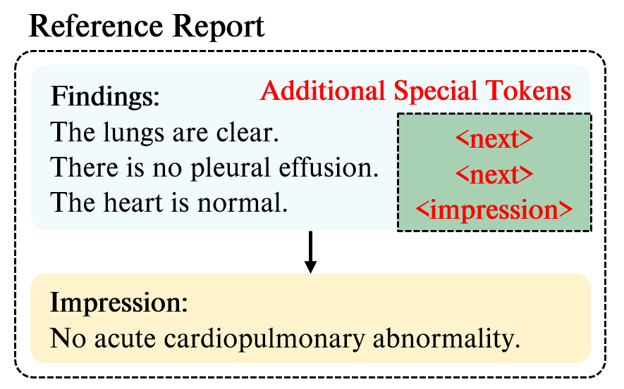
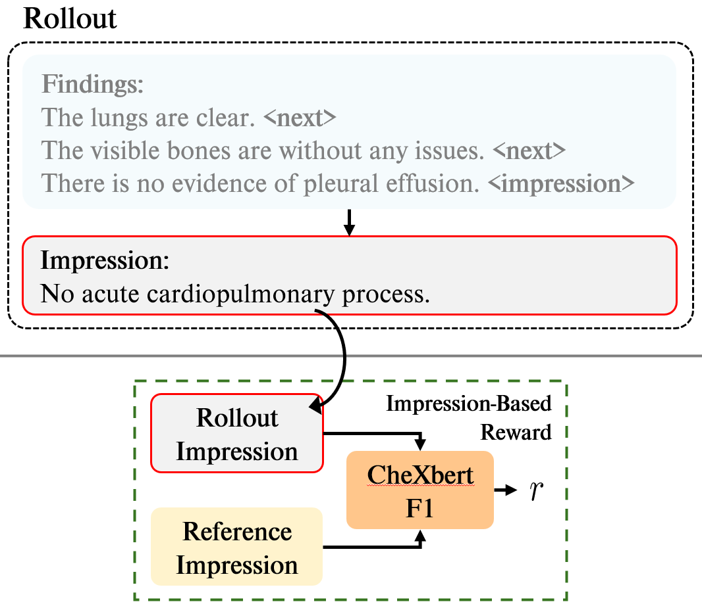
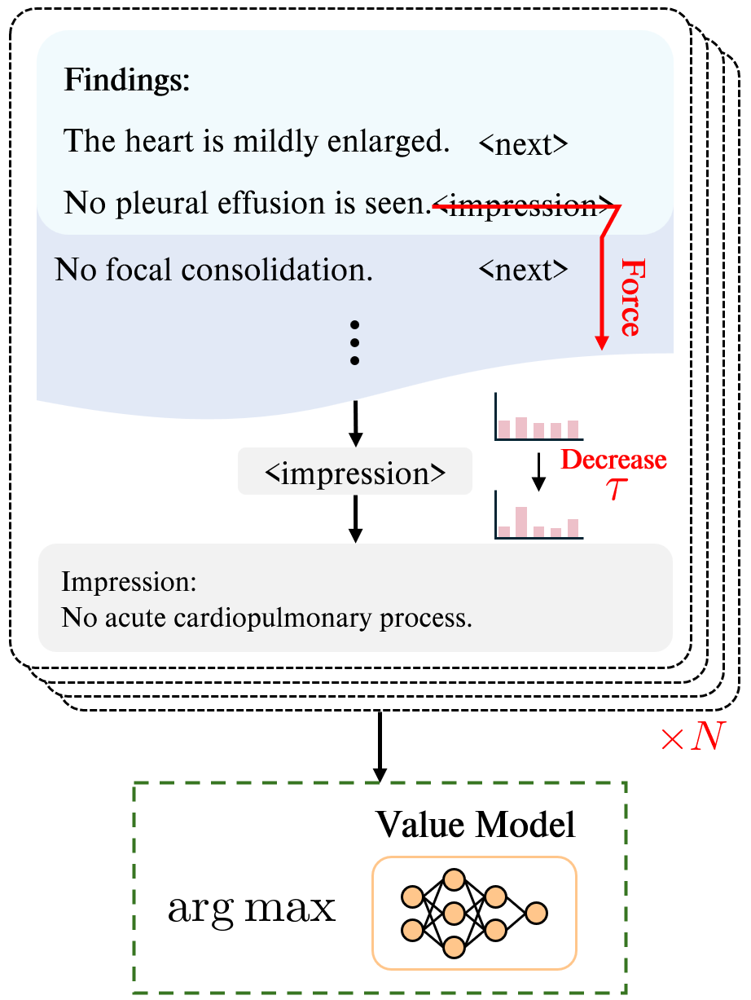

<h2 align="center">CLARIFID: Improving Radiology Report Generation by Reinforcing Clinically Accurate Impressions and Enforcing Detailed Findings</h2>
<p align="center">
<a href="https://doi.org/10.1016/j.eswa.2025.130633"></a>&nbsp;&nbsp;&nbsp;&nbsp;
    <a href="https://arxiv.org/abs/2507.17234"></a></p>


---
Official implementation for our paper: 
**"CLARIFID: Improving Radiology Report Generation by Reinforcing Clinically Accurate Impressions and Enforcing Detailed Findings"**

CLARIFID enhances radiology report generation by explicitly modeling the expert workflow from Findings to Impression. The framework employs section-aware pretraining, CheXbert-guided fine-tuning, and multi-view fusion to produce clinically accurate and coherent reports. 

You can check out the paper here: 

- **[Published Version (ESWA)](https://doi.org/10.1016/j.eswa.2025.130633)**
- **[arXiv Preprint](https://arxiv.org/abs/2507.17234)**

## Cite

If you find our work useful in your projects, please consider citing our paper:

```markdown
@article{LEE2026130633,
title = {CLARIFID: Improving radiology report generation by reinforcing clinically accurate impressions and enforcing detailed findings},
journal = {Expert Systems with Applications},
volume = {303},
pages = {130633},
year = {2026},
issn = {0957-4174},
doi = {https://doi.org/10.1016/j.eswa.2025.130633},
url = {https://www.sciencedirect.com/science/article/pii/S0957417425042484},
author = {Kyeongkyu Lee and Seonghwan Yoon and Hongki Lim},
keywords = {Radiology report generation, Reinforcement learning, Test time computation}
}
```

---

## Overview

This repository provides the implementation for our radiology report generation model. 
The workflow consists of:

0. **Dataset preprocessing** (`dataset_preprocessing.py`)

1. **Pretraining** (`pretrain.py`)

   The model is pretrained with explicit section conditioning to distinguish between Findings and Impression, enabling better structural and semantic separation of the two sections.

   

2. **Post-training** (`posttrain.py`)

   During post-training, CheXbert is used as a clinical expert to guide the model toward generating clinically accurate impressions. This process reinforces correct disease mentions and reduces clinically inconsistent predictions.

   

3. **Evaluation** (`evaluate.py`)

   During inference, next-token forcing is applied to ensure sufficient Findings generation before transitioning to the Impression section. Multiple candidate reports are then sampled and the final output is selected via Best-of-N re-ranking using the trained value model. Evaluation is conducted using standard report generation metrics and CheXbert-based clinical metrics.

   

---

## Requirements

You can install the required packages using:

```bash
pip install -r requirements.txt
```

### Datasets

Please download the following datasets:

- MIMIC-CXR
- IU X-Ray

### Preprocessed Data File

The preprocessed CSV file is listed below. 
Due to the MIMIC-CXR data usage license, we cannot release the processed files for MIMIC-CXR.

* [IU X-Ray](https://drive.google.com/file/d/1OL11Y2HBjuQZmZE7hqH3pecK1aeLHjkB/view?usp=sharing)

### Checkpoints

* [Pretrained](https://drive.google.com/file/d/1uDa0rjD3ZFNKJZ4WA8AejkpLADxQVKTa/view?usp=sharing)
* [+Post-trained](https://drive.google.com/file/d/1Y-_oezAjwPLUh2IC4T72iREKqBc0GmlO/view?usp=sharing)

---

## Additional Setup

### Evaluation Tool

* Clone and install `pycocoevalcap` for metric evaluation.

* To compute the CE metric, please download the [CheXbert](https://github.com/stanfordmlgroup/CheXbert) checkpoint.

